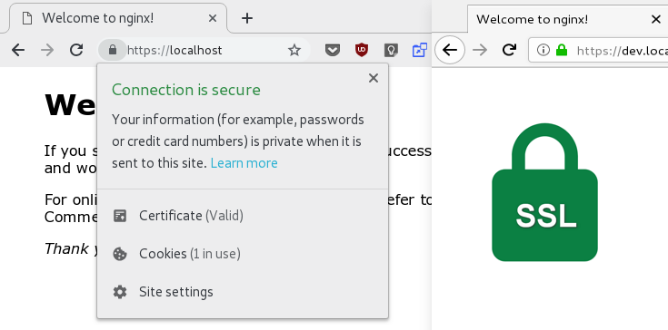
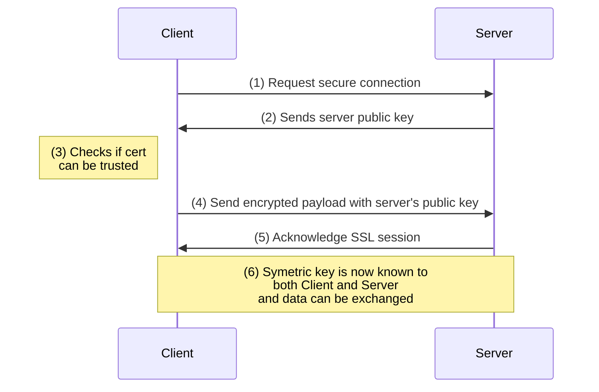

# Using self-signed HTTPS certificates (supporting Chrome 70)



## Target Audience

HTTPS and security in overall is becoming more and more important:

* Developers with applications making use of HTTP/2 and HTTPS 
* Micro-Services security (though you it's often just simple private/public key SSL)
* Attacks on Office W/LANs or Home Networks

You simple don't want off-security development and hit surprises like:

* Things stopping working on deployment since suddenly security restrictions production are in place. And you simply ignored them in development!
* Having ignored [Content Security Polices (CSP)](https://developer.mozilla.org/en-US/docs/Web/HTTP/CSP)  or other web security models!
* Worse: Your Facebook account was owned by a Hacker because you browsed the web with disabled XSS on your development browser only to make your app work since you didn't do your homework!


## How does SSL work?




- A browser attempts to connect to a web server secured with SSL. The browser/server requests that the web server identifies itself. The Server Name will be in in clear text within the Header (SNI) (1) 
- The web server sends the browser a copy of its x.509 public certificate (2)
- The browser checks to see whether or not it trusts the SSL certificate using it's known [certificate authorities](https://en.wikipedia.org/Certificate_authority). Browsers are currently raising the bar for valid certificates using mechanisms like HSTS ([HTTP Strict Transport Security](https://en.wikipedia.org/wiki/HTTP_Strict_Transport_Security))  or simply distrusting authorities like Symantic (Google). This is is also where our root certificate comes into place extending the list of trusted CAs (3)
- If so, it sends back a message to the server encrypted by the server's public certificate (4)
- The web server sends back a digitally signed acknowledgement to start an SSL encrypted session (5)
- Now we have established data exchange by establishing a symmetric key encryption (6)

## What do we do here?

* We use a `Makefile` to automate the whole process and can easily be customized
* We create a local root authority which will be used by systems to verify the validity of services
* We create a server certificate and test with HTTPS request on a docker based nginx 
* Of course the certificate authority (CA) has to be imported first to  to your client system(s)

## What do we *not* do here?

- We do not create intermediate certificates (but should be easy to add)
- We do not create revocation lists
- We do not create certificates for use on the Internet. 

## Where to use those certificates?

* Only on your local machine or your LAN! 
  
## Where do I get Trusted Certificates for my Website?

Please use [Let's Encrypt](https://letsencrypt.org/) with [SSL For Free](https://www.sslforfree.com/ ) or [ACME.sh](https://github.com/Neilpang/acme.sh) services.

ACME Services are now provided in most modern cloud applications like Envoy, Kong or traefik. Make sure ACME challenges are public and auto-refresh works!

If you're bound to your provider or corporation's insecurity policy make sure to know when you're certificates will expire or become invalid (e.g. Symantec Distrust with Chrome 66). 

## Getting started with your own Certificate

### Required System Packages

- make *– for using Makefile*
- openssl *– for SSL generation*
- docker *– for testing via nginx*
  
### Files and Folders

Everything is put into a Makefile to make easy customization possible. 

| File/Folder | Description                                                  |
| ----------- | ------------------------------------------------------------ |
| Makefile    | Commands to be used in shell                                 |
| root-ca/    | Root CA                                                      |
| cert/       | Server certificate                                           |
| Dockerfile  | Dockerfile for tsting with nginx                             |
| nginx/      | Config files for nginx *(certs and vhost-config are copied here when container starts)* |

### Usage 

##### Prerequisites: Host Entries and Ports

Make sure your testing domains  `/etc/hosts` point to 127.0.0.1 (for localhost this is not required on native Linux). Also ensure nothing is running on ports `:80` or `:443` by `sudo lsof -i :80 -i :443 -sTCP:LISTEN`

##### Example Entry to /etc/hosts:

``` 
127.0.0.1 www.dev.localhost sub.dev.localhost localhost dev.localhost
```

#### Generate Root CA

1. Specify option by the `ROOT_CA_*` keys in the `Makefile`.
2. Mind the `ROOT_CA_PASSWORD`. This can' be changed later and must not be empty!
3. Again, is your password really [secure](https://en.wikipedia.org/wiki/List_of_the_most_common_passwords)?
4. Generate a Root CA by `make generate-root-ca`
5. And import it by  `make install-root-ca` or following instructions in FAQ if it fails
6. View generated certificate by  `make view-root-ca`

From on here this should not be touched again. The Root CA can be distributed to all machines that need to verify the certificate in the next step.


#### Generate Server Certificate

1. Specify your domains in `CERT_ALT_DOMAINS` and `CERT_ALT_IPS` within the `Makefile`.  Make sure to escape with `\*.mydomain.tld` when using wild cards!

2. Generate a Root CA by `make generate-root-ca`

Note that the generated *private key* and *signing request* will not get deleted.  You have to run `make clean-cert` first or delete manually!


#### Testing in CLI

1. First build docker image by `make build-docker-image`
2. Adjust URLs and IPs to be testing in `TEST_DOMAINS` and `TEST_IPS` within the `Makefile`.
3. Then simply run make `test-container-https` which launches the container as daemon. `curl` make some requests and the output of *nginx-log* is then attached to the output.
4. You can repeat by `make test-https-requests`.  
5. Also `make run-container-attached` , `make shell-container` and `make log-container` are available for debugging
6. Chrome: allow-insecure-localhost

Please review the `Makefile` on what exactly happens.


####  Testing in Browser

1. Launch your favorite browser and don't forget to use `https://`-prefix!
2. You can use `make generate-cert run-container-attached` to play around with certificate alt-names!
   

## Certificate Requirements

For those curious these are the main requirements for Chrome 70 and Firefox not to throw any errors:

- SAN (subjectAltName) required
- Common Name = Server FQDN =  SAN
- at least SHA256 hashing
- at least 2048 bits signing
- correct `keyUsage = digitalSignature, nonRepudiation, keyEncipherment, dataEncipherment`
- secure ciphers to be used on server side (see nginx configs!)
- Only FQDN our fully supported in browser
  *(while Chrome shows green for dev.localhost Firefox won't!)
- Mind that HSTS checks will be cached in your browser ([chrome://net-internals/#hsts](chrome://net-internals/#hsts))
  

## How to Import Root Certificates

### Windows

##### CLI

```bash
certutil -addstore "Root" root-ca\$(ROOT_CA_NAME).crt
# certutil -addstore "CA" intermediate\$(ROOT_CA_NAME).crt
```

https://docs.microsoft.com/en-us/windows-server/administration/windows-commands/certutil

##### UI

1. Doubleclick ```root-ca/localhost.crt```
2. In the following Certificate Import Wizard choose "Local Machine"
3. Confirm and allow the changes made to the system in the UAC dialog

### Mac OSX

##### CLI

```bash
sudo security add-trusted-cert -d -r trustRoot -k /Library/Keychains/System.keychain root-ca/$(ROOT_CA_NAME).crt
```

https://www.unix.com/man-page/osx/1/security/

##### UI

1. Open up Keychain Access
2. Choose File › Import Items and ```root-ca/localhost.crt```
3. Enter password when prompted.

### Linux

##### Import Root Certificate

```bash
sudo cp -v root-ca/$(ROOT_CA_DOMAIN).crt /usr/local/share/ca-certificates/$(ROOT_CA_DOMAIN).crt
sudo update-ca-certificates --fresh
```

##### Update NSSDB

```bash
cat root-ca/localhost.pem 2>&1 \
	| sed -ne '/-BEGIN CERTIFICATE-/,/-END CERTIFICATE-/p' \
	| certutil -d sql:$$HOME/.pki/nssdb -A -t "TCu,Cu,Tu" -n "$(ROOT_CA_DOMAIN)"
```

https://chromium.googlesource.com/chromium/src/+/HEAD/docs/linux_cert_management.md

## Importing Root CA Browsers

### Chrome

Nothing special to do here. 

Chrome on Windows on MacOSX do open the system's certificate manager where you probably have already imported the root certificate. See *Windows*-section.

Chrome on Linux uses NSSDB. If you hit problems after playing around with certs you can do `make recreate-nssdb install-root-ca`

#### Chrome-Flag: allow-insecure-hosts

`chrome://flags#allow-insecure-localhost`  allows requests to localhost over HTTPS even when an invalid certificate is presented. This setting can be ommitted. You do not need to activate!

### Firefox

1. Open *Preferences*
2. Search for *Certificates* and click on the *View Certificates Button* 
3. In the now opened Certificate Manager click on tab *Authorities* and then on *Import* and choose the `root-ca/$(ROOT_CA_NAME).crt`.
   

## Acronyms and Terms

| Name                  | Description                                                  |
| --------------------- | ------------------------------------------------------------ |
| **HTTPS**             | HTTP for Secure Communication. The [communication protocol](https://en.wikipedia.org/wiki/Communication_protocol) is [encrypted](https://en.wikipedia.org/wiki/Encrypted) using [Transport Layer Security](https://en.wikipedia.org/wiki/Transport_Layer_Security) (TLS), or, formerly, its predecessor, Secure Sockets Layer (SSL). Note: 🅂 does not stand for SSL! |
| **H2, HTTPS/2**       | Successor to HTTP/1.1 with multiplexing. The Standard itself does not require usage of encryption, but all major client implementations (Firefox, Chrome, Safari, Opera, IE, Edge) have stated that they will only support HTTP/2 over TLS. |
| **FQDN**              | Fully qualified domain name like `http://subdomain.domain.tld` |
| **CA**                | Certification Authority which is used to verify against      |
| **Root-CA**           | Top-Level Authority                                          |
| **Intermediate-CA**   | Every Authority between the Root and your browser            |
| **CRL**               | A certificate revocation list. Certificate Authorities produce these as a way to de-authorize certificates before expiration. You can sometimes download them from CA websites. |
| **PEM**               | Defined in RFCs 1421 through 1424, this is a container format that may include just the public certificate (such as with Apache installs, and CA certificate files /etc/ssl/certs), or may include an entire certificate chain including public key, private key, and root certificates. Confusingly, it may also encode a CSR (e.g. as used here) as the PKCS10 format can be translated into PEM. The name is from Privacy Enhanced Mail (PEM), a failed method for secure email but the container format it used lives on, and is a base64 translation of the x509 ASN.1 keys. |
| **CSR**               | This is a Certificate Signing Request. Some applications can generate these for submission to certificate-authorities. The actual format is PKCS10 which is defined in [RFC 2986](https://tools.ietf.org/html/rfc2986). It includes some/all of the key details of the requested certificate such as subject, organization, state, whatnot, as well as the *public key* of the certificate to get signed. These get signed by the CA and a certificate is returned. The returned certificate is the public *certificate* (which includes the public key but not the private key), which itself can be in a couple of formats. |
| **KEY**               | This is a PEM formatted file containing just the private-key of a specific certificate and is merely a conventional name and not a standardized one. In Apache installs, this frequently resides in `/etc/ssl/private`. The rights on these files are very important, and some programs will refuse to load these certificates if they are set wrong |
| **.pkcs12 .pfx .p12** | - Originally defined by RSA in the [Public-Key Cryptography Standards](https://en.wikipedia.org/wiki/PKCS) (abbreviated PKCS), the "12" variant was originally enhanced by Microsoft, and later submitted as [RFC 7292](https://tools.ietf.org/html/rfc7292). This is a passworded container format that contains both public and private certificate pairs. Unlike .pem files, this container is fully encrypted. Openssl can turn this into a .pem file with both public and private keys: `openssl pkcs12 -in file-to-convert.p12 -out converted-file.pem -nodes` |
| **.cert .cer .crt**   | A .pem (or rarely .der) formatted file with a different extension, one that is recognized by Windows Explorer as a certificate, which .pem is not. |
| **PEM**               | Governed by RFCs, its used preferentially by open-source software. It can have a variety of extensions (.pem, .key, .cer, .cert, more) |
| **PKCS7**             | An open standard used by Java and supported by Windows. Does not contain private key material. |
| **PKCS12**            | A Microsoft private standard that was later defined in an RFC that provides enhanced security versus the plain-text PEM format. This can contain private key material. Its used preferentially by Windows systems, and can be freely converted to PEM format through use of openssl. |
| **DER**               | he parent format of PEM. It's useful to think of it as a binary version of the base64-encoded PEM file. Not routinely used very much outside of Windows. |
| **Subject**           | C= Country Name (2 letter code): DE<br />S= State or Province Name (full name) : Bavaria<br />L = Locality Name (eg, city): Munich<br />O= Organization Name (eg, company): Big Ass Corporate Ltd.<br />OU = Organizational Unit Name (eg, section): ---<br />CN = Common Name (eg, YOUR name): example.com |

Mostly taken from https://serverfault.com/questions/9708/what-is-a-pem-file-and-how-does-it-differ-from-other-openssl-generated-key-file


## Trackback

* https://github.com/redredgroovy/easy-ca – probably will get updated once know-how on valid Chrome70 certs has spread
* https://bjornjohansen.no/public-key-pinning – security: why HSTS is not enough

